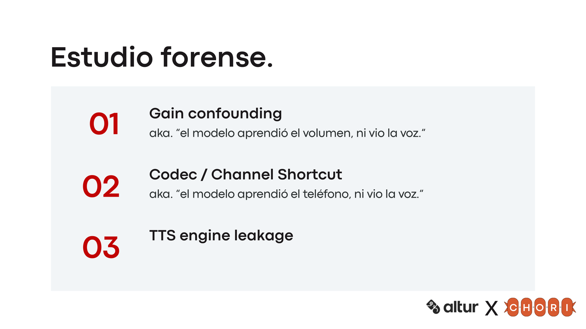
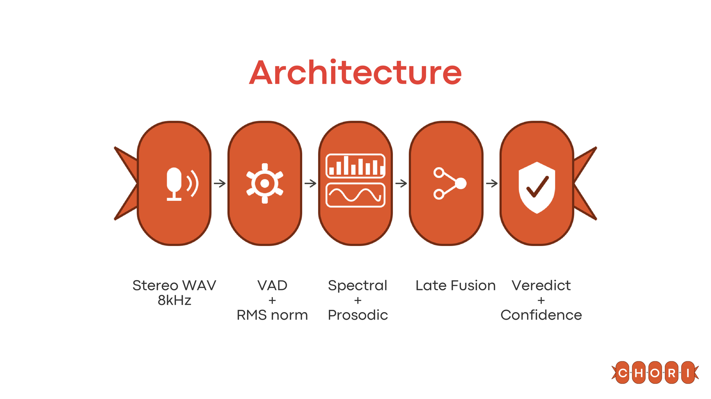
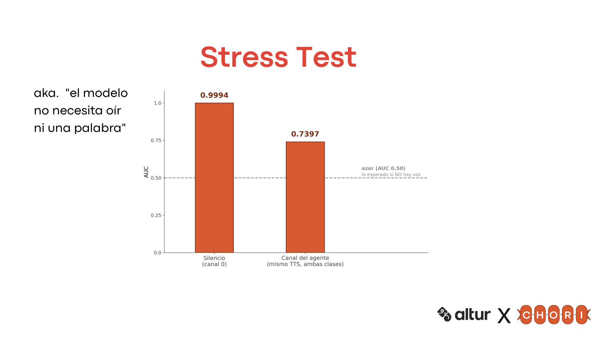

<p align="center">
  
</p>

<p align="center">
  
</p>
<p align="center"><em>Evidence that survives.</em></p>
<p align="center"><strong>HackMTY 2026 · track Altur · equipo Chorizo Circuits</strong></p>

---

**Chori** — **C**alibrador **H**olístico **O**rtogonal de **R**espuesta **I**nmediata — es el
sistema que decide, en tiempo real, si quien llama (canal 0 de una llamada telefónica estéreo a
8 kHz) es una persona real o una voz sintética.

```json
{
  "call_id": "call_...",
  "audio_base64": "<WAV completo en base64>",
  "sample_rate": 8000,
  "channels": 2
}
```

Respuesta: `{"is_synthetic": true, "confidence": 0.87}`. `is_synthetic` es obligatorio;
`confidence` es la probabilidad calibrada de la clase reportada, y este servicio siempre la
entrega para que el juez pueda reportar AUC, calibración y desempates.

**Endpoint vivo:** `http://64.177.80.133:8000` → [`POST /detect`](#despliegue)

# La idea central: robustness no es un feature, es la estrategia

Nos dieron 353 llamadas para construir algo robusto a hablantes, condiciones telefónicas y
ataques que van a seguir evolucionando. Con eso de fondo, el proceso fue deliberadamente en este
orden — y el orden es la parte que vale la pena defender frente a un juez:

1. **Entender antes que modelar.** Auditamos las 353 llamadas antes de entrenar nada — volumen,
   silencios, ancho de banda, códecs, posibles firmas del motor de síntesis.
2. **Encontramos una trampa.** Una sola característica de ancho de banda telefónico separaba
   humano de sintético con AUC≈0.82, sin tocar prosodia ni voz. Un modelo puede darte la
   respuesta correcta por la razón equivocada — desde ahí dejamos de preguntar solo "cuánto AUC"
   y empezamos a preguntar "qué está aprendiendo el modelo".
3. **Construimos dos fuentes de evidencia, no una rama más compleja.** Espectral (LFCC, cómo se
   distribuye la energía en frecuencia dentro de 8 kHz) y prosódica (F0 vía YIN, y las
   microvariaciones Jitter/Shimmer que vienen de ahí). Dos perspectivas físicamente distintas del
   mismo problema.
4. **Primero rompimos, después augmentamos.** Replicamos la metodología de un paper de robustness
   de detección de voz: corromper sistemáticamente (ruido, pitch shift, time stretch, low-pass,
   Opus) para ver qué sobrevivía *antes* de decidir qué defensa construir — no al revés.
5. **Con esa evidencia, defendimos el canal.** VAD para concentrarnos en habla activa,
   normalización RMS para no depender del nivel de audio, y simulación de G.711 + filtrado de
   banda durante entrenamiento, para que el modelo dejara de poder usar el atajo de canal.
6. **La amenaza evoluciona; el dataset también.** 353 llamadas del mismo puñado de motores TTS es
   un riesgo real de *fuga de motor* (el modelo memoriza la firma de una voz sintética, no
   síntesis en general). Ampliamos la diversidad con voces generadas por un proveedor TTS
   comercial y degradaciones artesanales, puestas deliberadamente a prueba contra el modelo.
7. **Descartamos lo que no se ganó su lugar.** Investigamos también las vías conductual y
   semántica que proponía el reto, y variantes de fusión, ensamble y ruteo por distancia —
   ninguna se queda si no aporta evidencia medible.

<p align="center">
  
</p>

*Respuesta correcta, razón incorrecta — tres veces. Cada uno de estos sesgos es un modelo que
"funciona" sin haber aprendido nada sobre síntesis de voz.*

# Qué corre hoy en producción — y qué se exploró

Somos explícitos sobre esto porque es exactamente el tipo de pregunta que un juez técnico hace:

| | Rama espectral (LFCC) | Rama prosódica (YIN + Jitter/Shimmer) |
|---|---|---|
| **En el endpoint `/detect` hoy** | ✅ Sí — `spectral_factory_lfcc_logreg@1` | ❌ No |
| Se construyó y se evaluó | ✅ | ✅ |
| Por qué no está fusionada en producción | — | Depende de `praat-parselmouth` (GPL-3, incompatible con la imagen de producción); su AUC aislado (0.83) cae fuerte con pitch-shift/time-stretch; agrega ~83 ms y una segunda ruta de inferencia. Descartada **para esta ventana de tiempo, no para siempre** |

El sistema servido es deliberadamente **una señal, bien hecha y auditada**, no un ensamble de dos
ramas por default — es la misma disciplina que aplicamos para descartar las otras vías (conductual,
semántica, ensamble, ruteo por Mahalanobis): cada pieza tiene que ganarse su lugar con evidencia,
no con complejidad.

Hay trabajo en curso sobre la misma rama espectral, evaluado a ciegas contra voces nunca vistas.
**Nada de eso está promovido ni servido**, y este README solo documenta lo que responde en el
endpoint: `spectral_factory_lfcc_logreg@1`.

# Architecture

<p align="center">
  
</p>

El mismo pipeline, en detalle:

```
                    [ WAV estéreo 8kHz ]
                            │
                  canal 0 (caller) únicamente
                            │
                     VAD + normalización RMS
                            │
                  [ Rama espectral: LFCC ]
              60 coeficientes estáticos + Δ + ΔΔ,
                media y desviación → 120 features
                            │
                 Regresión logística estandarizada
                            │
                   Calibración de Platt (OOF)
                            │
                     umbral fijo 0.5351
                            │
                            ▼
         POST /detect → {"is_synthetic", "confidence"}
```

El canal 1 es la agente de Altur — el mismo TTS en las dos clases — y **no** entra a la decisión.

El bundle servido es `spectral_factory_lfcc_logreg@1` (`run_id` `sha256-v1-8381e091…`, protocolo
`official_v1`). La API lo carga sin saber qué modelo es: cambiar de modelo es cambiar de bundle, no
de código, y si un artefacto no cuadra con su hash el servicio devuelve 503 en lugar de predecir.
El rollback es `acoustic_ch0_logreg@1` — 11 features espectrales del canal 0, AUC OOF **0.978**
[0.961, 0.991] sobre `train` — en `models/acoustic_ch0_v1`.

⚠️ **La simulación de G.711 y el paso-banda del punto 5 son parte de la investigación, no del
bundle servido.** El `transform_refs` del bundle está vacío: el port a NumPy que corre en
producción no incorporó la aumentación telefónica
([`docs/PORT_SPEC_SPECTRAL_FACTORY.md`](docs/PORT_SPEC_SPECTRAL_FACTORY.md) la marca como no
portada). Decirlo al revés sería atribuirle al servicio una defensa que no tiene.

La rama prosódica (F0 vía YIN → Jitter/Shimmer → fusión tardía) vive construida y evaluada en
[`research/spectral_factory/`](research/spectral_factory/) — es la evidencia que sostiene por qué
quedó fuera del bundle servido, no un experimento abandonado sin razón.

# Resultados del stress test — números reales, no de la lluvia de ideas

Antes de decidir qué defensa construir, medimos qué rompía el sistema. Seis condiciones sobre el
set de robustez completo, out-of-fold (cada llamada evaluada por un modelo que nunca la vio):

| Condición | AUC espectral | AUC prosódica (aislada, no en producción) |
|---|---:|---:|
| Clean | 1.000 | 0.828 |
| Ruido (SNR 10dB) | 0.971 | 0.801 |
| Pitch shift (+1 semitono) | 0.975 | 0.625 |
| Time stretch (0.9x) | 0.989 | 0.621 |
| Low-pass (3400Hz) | 0.995 | 0.837 |
| Opus (16kbps) | 0.999 | 0.748 |

Fuente: `research/spectral_factory/phase1_stress_test/`. La rama espectral es la que sostiene la
robustez del sistema servido; la prosódica es robusta a ruido/códec pero se degrada fuerte con
pitch/tempo — exactamente la evidencia que motivó no fusionarla todavía.

⚠️ **El 1.000 de la fila «Clean» no es una nota de aprobación.** Es una columna saturada sobre el
mismo dataset y la misma cadena de grabación; lo que la tabla muestra bien es la **caída relativa**
bajo cada perturbación, no la exactitud absoluta. Por qué, en la siguiente sección.

# Honestidad ante los jueces — lo que no afirmamos

**No tenemos un holdout limpio para el modelo servido, y no lo vamos a presentar como si lo
tuviéramos.**

- **`val` ya no es holdout.** Su 0.973 sobre `val` (n = 71) se usó para **elegir** entre tres
  candidatos, y `val` ya se había mirado cuatro veces antes. La cifra es optimista; la que cuenta
  es la del set oculto.
- **El OOF por llamada sobre `train` satura** (AUC ≈ 1.0) y no anticipa el costo de generalizar a
  hablantes nuevos.
- **Parte de la señal es la cadena de producción, no la voz.** Corrimos los dos controles contra
  nosotros mismos y **los dos salieron positivos**: solo el silencio del caller separa con AUC OOF
  **0.9994** [0.998, 1.000], y el canal de la agente —mismo TTS en ambas clases— con **0.7397**
  [0.683, 0.801]; los dos más fuertes que en el baseline acústico. Sin voz de por medio, el modelo
  seguía acertando. Sospechoso y no descartable: lo seguimos auditando.

  <p align="center">
    
  </p>

- **Errores confiados, no de umbral.** En `val` falla dos humanas con p(sintética) entre 0.95 y
  0.997.
- **El detector no tiene un "no sé".** Sobre entradas que no son voz —ruido blanco, silencio
  digital, un tono de 440 Hz, ruido rosa— contesta `is_synthetic=false` con confianza entre 0.9997
  y 1.0. Una logística sobre features estandarizadas extrapola en línea recta: fuera de
  distribución la sigmoide satura.
- **Con poco audio se equivoca con seguridad.** Medido en el baseline acústico: a 5 s el AUC es
  0.40 (invertido) con la confianza más alta de la curva. Por eso `/detect` **analiza siempre la
  llamada completa** y declara 20 s como mínimo. La curva de truncación **no** se volvió a medir
  para LFCC: los 20 s son heredados.
- **La conversación no está decidiendo.** Si se revuelven los tiempos de turno dejando el audio
  intacto, cambia el 2 % de los veredictos. Las features conductuales no suman (+0.0015, dentro del
  intervalo), así que el bundle es solo acústico.
- **No probamos generalización cross-vendor.** Todo el sintético del dataset oficial sale de un
  solo proveedor TTS comercial. La ampliación del corpus ataca esto, no lo resuelve del todo.
- **353 llamadas siguen siendo 353 llamadas.** No decimos haber resuelto los ataques de voz
  futuros — la prueba real es qué pasa con un generador, vendor o ataque que nunca vimos.

Esta misma lista viaja **dentro del bundle** y sale por `GET /version`, en el campo `limitations`:
el juez la puede leer sin preguntarnos.

Existe un segundo bundle, `spectral_factory_lfcc_trainval_v1`, ajustado con `train`+`val` (353
llamadas). **No está promovido y no se sirve:** al entrenar con `val` se acabó el holdout y sus
métricas son tautológicas.

# Correr en local

```bash
make setup && make test                  # Python 3.12
make serve                               # /detect en localhost:8000 sirviendo models/current
make docker && make docker-run           # la imagen de producción
URL=http://127.0.0.1:8000 make smoke
```

`make serve` exporta `ALTUR_BUNDLE_DIR=models/current`. **Sin esa variable el API arranca con
`ConstantDetector` y `/health/ready` igual responde 200** — es el arranque de A0, de cuando todavía
no existía un modelo, pero como servidor real sería una constante que se lee como un modelo. Lo
primero que hay que mirar al levantar el servicio es qué detector declara readiness:

```bash
curl -s http://127.0.0.1:8000/health/ready
# {"status":"ready","detector":"spectral_factory_lfcc_logreg@1"}   <- correcto
# {"status":"ready","detector":"constant@1"}                        <- NO sirve; falta el bundle
```

# El contrato de `/detect`

Una llamada por petición, `POST` con `Content-Type: application/json`:

```json
{
  "call_id": "call_...",
  "audio_base64": "<base64 de los bytes exactos del WAV completo>",
  "sample_rate": 8000,
  "channels": 2
}
```

El WAV es estéreo a 8 kHz: **canal 0 es quien llama** y canal 1 es la agente. La respuesta es
HTTP 200 con:

```json
{"is_synthetic": false, "confidence": 0.999889}
```

`is_synthetic` es obligatorio y booleano. `confidence` es opcional para el contrato y está en
`[0, 1]`; aquí es la probabilidad calibrada **de la clase reportada**, no `p(sintética)` — si el
veredicto es humano con 0.96, son 96 % de confianza en *humano*. Este servicio la entrega en todas
las respuestas, para que Altur pueda reportar AUC y calibración y usarla de desempate.

El juez permite 30 segundos por llamada, las llamadas duran de 1 a 4 minutos y el body llega a unos
5 MB. Un timeout, un status distinto de 200 o una respuesta sin `is_synthetic` booleano cuentan como
error. La métrica principal es balanced accuracy sobre callers y voces no vistos. El servicio
también tolera WAV crudo (`Content-Type: audio/wav`) y multipart, pero el camino oficial es el JSON
de arriba.

Errores: base64 inválido devuelve **HTTP 400** con `{"error":"bad_base64"}` y sin stack trace. Si el
bundle no verifica, `/health/ready` y `/detect` devuelven **503** con la razón; el proceso queda
vivo a propósito, porque un proceso muerto no diagnostica. **Nunca** se cae en una predicción
constante por accidente: el modo constante existe solo tras poner `ALTUR_EMERGENCY_CONSTANT=1` a
mano.

# Despliegue

**URL vigente:** `http://64.177.80.133:8000` — `POST /detect`

CPU-first en Vultr, sin GPU, imagen ligera (~70 MB) y sin salida a internet en el camino de
inferencia: se ejecutó `predict()` con `socket.socket` parcheado para lanzar excepción, y pasa.
Instancia `voc-c-4c-8gb-75s` en Ciudad de México (4 vCPU dedicados), contenedor con
`--restart unless-stopped`, filesystem de solo lectura, `--cap-drop ALL` y
`--security-opt no-new-privileges`; SSH solo con llave, firewall de Vultr activo y un único puerto
publicado. `confidence` se calibra con Platt sobre logits out-of-fold, y el umbral se eligió
considerando explícitamente el costo asimétrico de un banco: pedir validación extra a un cliente
legítimo no cuesta lo mismo que dejar pasar un fraude sintético.

**Limitación conocida: el endpoint es HTTP, no HTTPS.** Se sirve sobre IP directa y no hay dominio
asociado, así que no hay certificado que emitir. El contrato de Altur no exige TLS y la evaluación
es en vivo. Si se consigue un dominio, la ruta es un reverse proxy con certificado automático
delante del mismo contenedor; el servicio no cambia.

Desplegar una imagen nueva es `scripts/deploy_monitor.sh usuario@host`, que etiqueta lo que está
servido como rollback **antes** de subir nada, compara el ID de la imagen remota contra la local y
aborta sin tocar el contenedor si no coinciden. La IP no vive en ese script: va por argumento.
**La WiFi del evento bloquea SSH saliente**, así que operar el servidor exige hotspot o la
consola web de Vultr. El procedimiento completo de respaldo y sus simulaciones están en
[`docs/RUNBOOK_FAILOVER.md`](docs/RUNBOOK_FAILOVER.md).

## Comprobar el endpoint

```bash
curl -s http://64.177.80.133:8000/health        # {"status":"alive","detector_loaded":true}
curl -s http://64.177.80.133:8000/health/ready  # {"status":"ready","detector":"spectral_factory_lfcc_logreg@1"}
curl -s http://64.177.80.133:8000/version       # bundle, run_id, umbral y limitations
```

`/version` debe declarar el mismo `run_id` y el mismo `threshold` que el bundle local:

```bash
./.venv/bin/python -c "import json;m=json.load(open('models/current/manifest.json'));print(m['detector_name'],m['run_id'],m['threshold'])"
# spectral_factory_lfcc_logreg@1 sha256-v1-8381e0919b71cbc5f81473b12231841231921c932567505be202283d669d2da0 0.5351387419964889
```

Con el **cliente oficial de Altur**, que vive en `data/official/check_endpoint.py` tal como lo
publicaron (solo biblioteca estándar):

```bash
./.venv/bin/python data/official/check_endpoint.py \
  --url http://64.177.80.133:8000/detect --split val --n 20 \
  --manifest data/manifest.csv --audio-dir data/audio
```

Requiere el dataset descargado (`make data`); ni el audio ni el manifest se redistribuyen en este
repositorio.

## Rendimiento medido

Medido el **2026-09-13** contra el endpoint desplegado —el contenedor Docker en Vultr, no una
corrida local— con el cliente oficial de Altur y desde la red del evento:

| prueba | resultado |
|---|---|
| `check_endpoint.py --split val --n 20` | 20/20 respondidas, **0 errores**, media **0.99 s**, máximo **1.55 s** |
| `check_endpoint.py --split train --n 30` | 30/30 respondidas, **0 errores**, mediana **0.98 s**, p95 **1.38 s**, máximo **3.35 s** |
| cuerpo JSON de **11.69 MB**, 5 corridas | HTTP 200 en **1.66–3.55 s**; inferencia en el servidor **59.5–62.3 ms** |
| base64 inválido | HTTP **400**, `{"error":"bad_base64"}`, sin stack trace |

**78 llamadas al endpoint desplegado, 0 errores, ninguna por encima de 3.4 s** contra un límite de
30 s. El cuerpo esperado por el juez ronda los 5 MB; con más del doble de ese tamaño el margen
sigue siendo de **~9×** en el peor caso medido.

**Lo que varía es la red, no el servidor.** La inferencia se mueve dentro de 3 ms entre corridas
(59.5–62.3 ms) mientras el tiempo total va de 1.66 s a 3.55 s sobre exactamente el mismo cuerpo: lo
que se está midiendo casi por completo es la subida del cliente. En local, sin red de por medio, la
misma corrida de 20 da máximo **0.129 s**.

La balanced accuracy de esas corridas **no es validación honesta**: ver «Honestidad ante los
jueces». Lo que estas cifras sí demuestran es contrato, disponibilidad y presupuesto de tiempo.

## Troubleshooting

| síntoma | causa probable | qué hacer |
|---|---|---|
| `/health/ready` dice `constant@1` | el proceso arrancó sin `ALTUR_BUNDLE_DIR` | relanzar con `ALTUR_BUNDLE_DIR=models/current` (o usar `make serve`) |
| `/health/ready` da 503 con `reason` | un artefacto del bundle no cuadra con su hash | reconstruir el bundle o hacer rollback a `models/acoustic_ch0_v1`; no forzar el arranque |
| `/health` 200 pero `/detect` 503 | mismo caso: el proceso está vivo para diagnosticar | leer `reason` en `/health/ready` |
| `HTTP 400 bad_base64` | el cliente mandó base64 inválido o truncado | reenviar los bytes exactos del WAV |
| connection refused desde fuera | el contenedor no corre o el firewall cerró el puerto | consola web de Vultr; `docker ps` y el puerto 8000 |
| el cliente da timeout y el servidor se ve sano | subida lenta: el cuerpo pesa MB, no KB | medir con `curl -w '%{time_total}'`; cambiar de red antes de culpar al servidor |
| SSH al servidor cuelga | la WiFi del evento bloquea SSH saliente | hotspot, o la consola web de Vultr |
| el puerto 8000 ya está ocupado en local | otro proceso o contenedor | `PORT=8001 make serve` |

El guion de demo, con su checklist previo y el plan de recuperación por red, está en
[`DEMO_ALTUR.md`](DEMO_ALTUR.md).

# Equipo

| Persona | Aporte | Dónde vive |
|---|---|---|
| Joaquín | Integración: arnés de evaluación, protocolo, controles de confound, bundle, `/detect`, contenedor y failover | `src/altur/`, `scripts/`, `docs/` |
| Biniza | Modelo: auditoría forense de canal, rama prosódica (Shimmer/Jitter vía YIN), rama espectral de referencia (LFCC), fusión tardía, calibración de referencia y stress test | `research/spectral_factory/` |
| Ricardo | Producto e investigación; set de robustez con seis condiciones (ruido, pitch, tempo, pasa-bajas, Opus); diversificación del dataset | Perturbaciones v2 |
| Regina | UX y storytelling | Pitch |

El trabajo de Biniza se hizo en un repositorio aparte y se incorporó aquí **sin** los archivos por
llamada que contenían identificadores del dataset.

# Datos y privacidad

El audio, `manifest.csv`, los identificadores de llamada, los folds y las predicciones por
llamada **no se redistribuyen**, por los términos del dataset. Solo se publican agregados.
`make data` descarga el dataset oficial y verifica su SHA-256; `make protocol` regenera grupos y
folds de forma determinista.

Más detalle: [`docs/ARCHITECTURE.md`](docs/ARCHITECTURE.md) ·
[`docs/MODEL_CARD.md`](docs/MODEL_CARD.md) ·
[`docs/MODEL_HANDOFF.md`](docs/MODEL_HANDOFF.md) ·
[`docs/PORT_SPEC_SPECTRAL_FACTORY.md`](docs/PORT_SPEC_SPECTRAL_FACTORY.md) ·
[`docs/DATA_PROTOCOL_CARD.md`](docs/DATA_PROTOCOL_CARD.md) ·
[`docs/LICENSE_AUDIT.md`](docs/LICENSE_AUDIT.md).

---

<p align="center"><strong>353 llamadas no fueron excusa.</strong><br><em>— Evidence that survives.</em></p>
